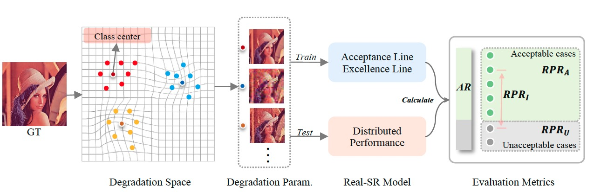

<p align="center">
    
</p>

## SEAL: A Framework for Systematic Evaluation of Real-World Super-Resolution  <br> ICLR 2024 Spotlight [[Paper Link]](https://arxiv.org/pdf/2309.03020.pdf) 


[Wenlong zhang](https://wenlongzhang0517.github.io/)<sup>1,2</sup>, [Xiaohui Li](https://github.com/xh9998)<sup>2,3</sup>, [Xiangyu Chen](https://chxy95.github.io/)<sup>2,4,5</sup>, [Yu Qiao](https://scholar.google.com.hk/citations?user=gFtI-8QAAAAJ&hl=zh-CN&oi=ao)<sup>2,5</sup>, [Xiaoming Wu](http://www4.comp.polyu.edu.hk/~csxmwu/)<sup>1</sup> and [Chao Dong](https://scholar.google.com.hk/citations?user=OSDCB0UAAAAJ&hl=zh-CN)<sup>2,5</sup>

<sup>1</sup>The HongKong Polytechnic University
<sup>2</sup>Shanghai AI Laboratory
<sup>3</sup>Shanghai Jiao Tong University <br>
<sup>4</sup>University of Macau
<sup>5</sup>Shenzhen Institute of Advanced Technology, Chinese Academy of Sciences

## Highlight

Our relative, distributed evaluation approach **SEAL** serves as a complement to existing evaluation methods that solely rely on absolute, average performance, addressing their limitations and providing a valuable alternative perspective for evaluation. 

We consider **SEAL** as the **first step** towards creating an unbiased and comprehensive evaluation platform, which can promote the development of real-SR.

<br>
<p align="center">
  
  <br>
  Fig. Our SEAL consists of a clustering-based approach for degradation space modeling and a set of metrics based on representative degradation cases.
</p>
<br>


## This repository contains

* **SE benchmark test sets**, including:

  * Set14-SE
  * Urban100-SE
  * DIV2K_val-SE
  * ...

* **Two reference lines**:

  * Acceptance line
  * Excellence line

* **Two systemactic metrics**:

  * AR (Acceptance Rate)
  * RPR (Relative Performance Ratio)

* **A coarse-to-fine evaluation protocol**

<br>
<p align="center">
  
  <br>
  Fig. A coarse-to-fine evaluation protocol to rank different real-SR models with the proposed metrics.
</p>
<br>

* **Visualization of distributional performance** 

<br>
<p align="center">
  
  <br>
  Fig. Distribution results under our SEAL evaluation.
</p>
<br>

## :new:Update

- **2023.09.07**: Repo is released.

## :climbing:TODO
- [x] Release code and pretrained models:computer:.
- [ ] Update SE test sets links:link:.


## :black_square_button:Benchmark Results


| SysTest Set14                                                              | PSNR-S $\uparrow$ | AR $\uparrow$ |  RPR $_I\downarrow$ | RPR $_A \downarrow$ | RPR $_U \uparrow$ |
| ----------------- | :----- |:--------: | :---: | :---: | :------: |
| SRResNet              |  20.95   |    0.00    | 0.02 | 0.00 |  0.03   |
| DASR                   |  21.08 |  0.00   | 0.01 | 0.00 |  0.02   |
| BSRNet                    |  22.77 |  0.59   | 0.42 | 0.72 |  0.27   |
| RealESRNet              |  22.67 |  0.27   | 0.28 | 0.63 |  0.28   |
| RDSR             |  22.44 | 0.08    | 0.23 | 0.63 |  0.21   |
| RealESRNet-GD          |  22.82 | 0.43    | 0.37 | 0.74 |  0.33   |
| SwinIR                 |  22.61 |   0.41  | 0.24 | 0.58 |  0.29   |

## Installation

```shell
# 
cd SEAL
pip install -r requirements.txt
python setup.py develop
```

### Data Preparation

Download SE test sets from [google drive](https://pan.quark.cn/s/01b612659918) or [quark pan](https://pan.quark.cn/s/01b612659918). Put them to `datasets/`.

or Generate **NEW** SE test sets by

```shell
python scripts/data_generation/data_generation.py
```

###  Acceptance and Excellence lines

Download acceptance and excellence lines from [google drive](https://pan.quark.cn/s/ea19e64e201e) or [quark pan](https://pan.quark.cn/s/ea19e64e201e). Put them in `modelzoo/`. 

### Inference the real-SR model on SE test sets

  * [Inference](scripts/inference/inference_line.py) Real-SR model on the SE test sets provided by us.

  ```shell
  python scripts/inference/inference_SE.py
  ```

  * For new SE test sets:
  
     * [Inference](scripts/inference/inference_line.py) the acceptance and excellence lines on the new SE test sets. 
     * [Inference](scripts/inference/inference_line.py) Real-SR model on the new SE test sets.

  ```shell
  python scripts/inference/inference_SE.py
  ```

### Get the common-used IQA performance on SE test sets

```shell
python scripts/metrics/cal_psnr_ssim.py # It includes LPIPS and NIQE
```

The results are saved in a CSV file with each line named in form 'model name_ test metrics'(such as [line.csv](scripts/AR_RPR/csv) and [model.csv](scripts/AR_RPR/csv)).

### Get AR and RPR performance

```shell
python scripts/metrics/calculate_AR_RPR.py # It includes LPIPS and NIQE
```

## Citation

```
@article{2023seal,
  author    = {Wenlong Zhang, Xiaohui Li, Xiangyu Chen, Yu Qiao, Xiao-Ming Wu, Chao Dong},
  title     = {SEAL: A Framework for Systematic Evaluation of Real-World Super-Resolution},
  journal   = {arxiv},
  year      = {2023},
}
```

## Contact
If you have any question, please email wenlong.zhang@connect.polyu.hk.
